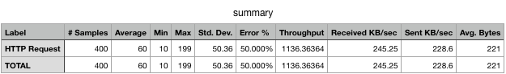

# 基于Redis的轻量级分布式限流组件

### 特点

- 轻量级，限流核心基于Redis Lua脚本实现

- 支持令牌桶、漏桶、滑动窗口等限流算法

- 支持Zookeeper、Consul等多种配置中心

- 支持Spel表达式，能够实现多维度限流

### 压测

##### 令牌桶算法

- 限流指标：

1. rate：200（每秒生成200个令牌）

2. capacity：200（令牌桶容量200个）

- 压测指标：

1. 并发：200

2. 循环次数：2

- 压测结果：

令牌生成速率为200/s，令牌桶容量200，并发200，循环两次，总共400个请求，压测会有50%的请求被限流调，与压测结果一致

##### 漏桶算法

- 限流指标：

1. rate：200（每秒通过200个请求）

2. capacity：200（桶最大容量200个）

- 压测指标：

1. 并发：200

2. 循环次数：2

- 压测结果：

每秒通过200个请求，桶的容量为200，压测的指标为200并发循环两次，第一个循环将桶装满，第二个循环全部被限流，与压测结果一致

